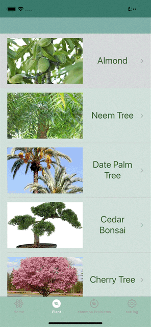
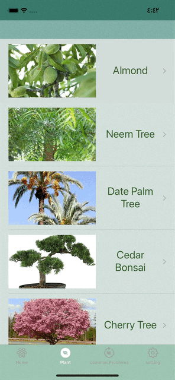

# Final_iOS_Bootcamp_Project-PlantCare-Atheer-Abdullah
Personal plant care helper.

## Motivation
I studied Biology and I love plants and the right way of taking care of them. 

## Project description
The PlantCare app developed to help people to take care about their plants. 
It will work as a reminder to water, fertilize and mistor them in the scheduled time.

## Target User
People interested in plants and owning them.

## User stories
<<<<<<< HEAD
●   Watering tasks at the right time

● Displays information، pictures about plants and their care and will be able to search by the plant's name.

● Shows the user the plant's needs such as water, fertilizer.

● Dispaly a description about the plant.

● Authentication

=======
 
 ## Demo 
 
 
 
 

